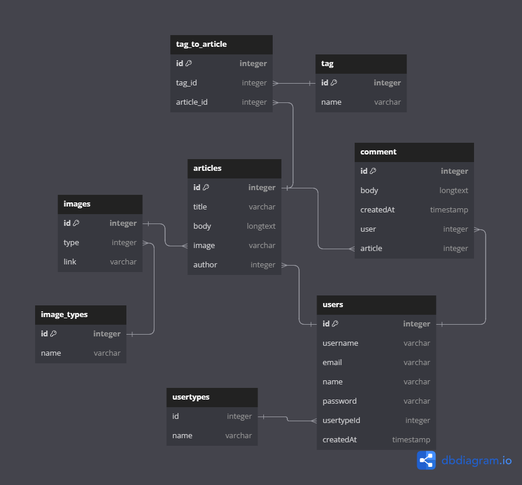

# Xedium:
 Content management system to write your [blogs | posts | articles]  

## Database schema: 


## Tools used:
- Nest.js
- PostgreSQl
- TypeORM

## How to run the project:
#### - this project uses PostgreSQl as a database so you need to install it first till I dockerize the project :D
- Clone the repo
    ```bash
    git clone https://github.com/Ahmed1monm/Meduim-clone.git
    ```
- install dependencies
    ```bash
    npm install
    ```
- create a .env file and add the following variables:
    ```bash
    APP_PORT=3000
    ENVIROMENT=development
    
    #database config
    DB_HOST=localhost
    DB_PORT=5432
    DB_USER=postgres
    DB_PASSWORD=password
    DB_NAME=meduim-nestjs
    DB_TYPE=postgres
    ```


